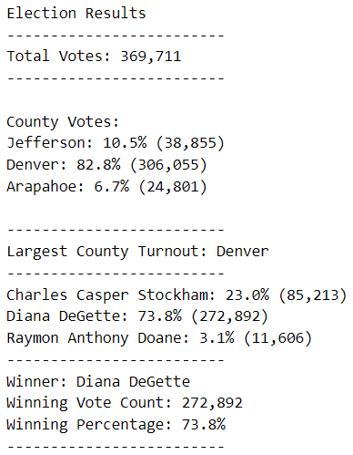

# PyPoll with Python (Module 3)

[Link to Python code](PyPoll_Challenge.py)

## Overview of Election Audit

### Purpose
Completed an election audit of a recent local congressional election in Colorado.

Determined the following:
1. Assessed Candidate results: 
* Determiend the total number of votes cast in the election.
* Compiled a list of all candidates receiving votes.
* Calculated the total votes received by each candidate.
* Calculated the percentage of votes won by each candidate.
* Determined the winner of the election by popular vote.

2. Assessed County results:
* Compiled a list of all Counties where votes were cast in the election.
* Calculated the total votes cast in each County.
* Calculated the percentage of total votes cast in each County.
* Determinated the County that had the largest number of votes cast.  

### Resources

This project was prepared using the following:
* Python 3.7.6
* Visual Studio Code 1.66.1

* Source data provided by the Colorado Board of Elections: [Link to source data](Resources/election_results.csv)

## Election Audit Results
The election outcomes are as follows:

* A total of 369,711 votes were cast in the congressional election.
	* County Results
		* A total of 24,801 votes were cast in Arapahoe County, for 6.7% of the total
		* A total of 306,055 votes were cast in Denver County, for 82.8% of the total
		* A total of 38,855 votes were cast in Jefferson County, for the remaining 10.5% of the total
			* __Denver County had the largest number of votes__
			
	* County Results	
		* Candidate Diana DeGette received 272,892 votes, for 73.8% of the total
		* Candidate Raymon Anthony Doane received 11,606 votes, for 3.1% of the total
		* Candidate Casper Stockham received 85,213 votes, for the remaining 23.0% of the total
			* __The winner of the election was Diana DeGette, who received 272,892 votes for 73.8% of the total.__

## Election Audit Summary
The script prepared to assess this election could easily be modified to include additional functionality to support upcoming elections.

First, it could used to assess the results of multiple congressional elections by associating each county with a specific congressional district.   

Second, the results could be presented in descending order based on votes recieved.  
This would make the results easier to read by placing the winning candidate and/or County that received the most votes at the top of the list.

Lastly, graphical representations of the election results could be included in the package.
